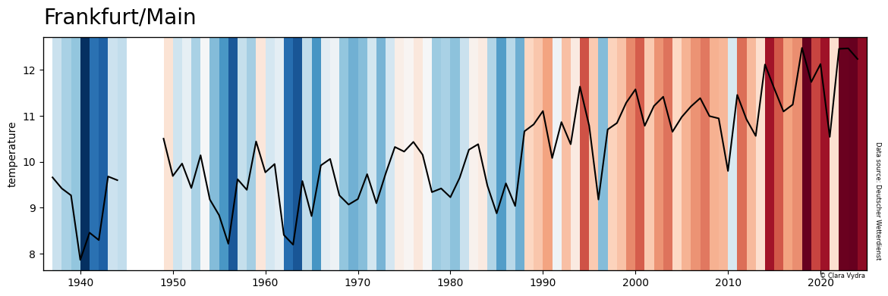

# plotting_climate_stripes_de

## German

Einfach für jede der Messstationen des DWD ein Klimastreifendiagramm erstellen und die Temperaturerhöhung darstellen:

run_stripes.py mit einer Liste der gewünschten Klimastationen laufen lassen (Übersicht beim [DWD](https://www.dwd.de/DE/leistungen/klimadatendeutschland/stationsuebersicht.html)). Plots werden im gleichnahmigen Ordner gespeichert.

Plot Inspiration und Code vom [DKRZ](https://docs.dkrz.de/doc/visualization/sw/python/source_code/python-matplotlib-warming-stripes-and-trend.html).

### to-do
- Umgang mit fehlenden Werten
- Design verbessern
- climate bar plots

## English

Simply create a climate strip chart for each of the DWD measuring stations and display the temperature increase:

Run run_stripes.py with a list of the desired climate stations (overview at [DWD](https://www.dwd.de/DE/leistungen/klimadatendeutschland/stationsuebersicht.html)). Plots are saved in the folder of the same name.

Plot inspiration and code from the [DKRZ](https://docs.dkrz.de/doc/visualization/sw/python/source_code/python-matplotlib-warming-stripes-and-trend.html).

### to-do
- handling missing values
- tweaking design
- climate bar plots